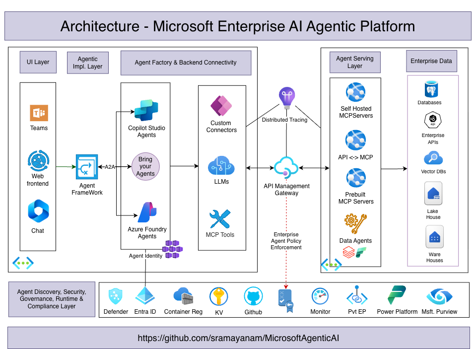

# Bridge Engineering Multi-Agent System

A production-ready multi-agent system built with **Microsoft Agent Framework** (preview) and **A2A Protocol** for bridge engineering data analysis and visualization.



## 🌟 Overview

This system orchestrates multiple AI agents to provide comprehensive bridge engineering solutions:

1. **SQL Foundry Agent** - Natural language to SQL query agent wrapping Azure AI Foundry
2. **Python Tool Agent** - Visualization and data analysis using Semantic Kernel with Azure Container Apps Dynamic Sessions
3. **Agent Orchestrator** - Coordinates multi-agent workflows via A2A protocol
4. **Streamlit UI** - Web interface for interactive agent orchestration

## 🏗️ Architecture

```
┌─────────────────────────────────────────────────────────────────┐
│                      Streamlit Web UI                           │
│                   (streamlit_app.py)                            │
└──────────────────────┬──────────────────────────────────────────┘
                       │
                       ↓
┌─────────────────────────────────────────────────────────────────┐
│              Agent Orchestrator (A2A Client)                    │
│              (agent_orchestrator_a2a.py)                        │
└──────┬────────────────────────────────────────────┬─────────────┘
       │                                            │
       ↓                                            ↓
┌──────────────────────┐              ┌──────────────────────────┐
│  SQL Foundry Agent   │              │  Python Tool Agent       │
│  (Port 10008)        │              │  (Port 10009)            │
│                      │              │                          │
│  • Natural Language  │              │  • Matplotlib/Pandas     │
│    to SQL            │              │  • Chart Generation      │
│  • Azure AI Foundry  │              │  • Semantic Kernel       │
│  • Database Queries  │              │  • Code Execution        │
└──────┬───────────────┘              └──────┬───────────────────┘
       │                                     │
       ↓                                     ↓
┌──────────────────────┐              ┌──────────────────────────┐
│ Azure AI Foundry     │              │ Azure Container Apps     │
│ NL2SQL Agent         │              │ Dynamic Sessions         │
└──────────────────────┘              └──────────────────────────┘
```

## ✨ Features

### SQL Foundry Agent
- Natural language to SQL conversion for bridge engineering databases
- Integration with Azure AI Foundry and Microsoft Fabric Data Agent
- Supports complex queries: beams, girders, bents, decks, materials, compliance
- GDOT standards integration
- Real-time streaming responses via A2A protocol

### Python Tool Agent
- Create visualizations (bar charts, line graphs, pie charts, heatmaps)
- Execute Python code in secure Azure Container Apps Dynamic Sessions
- Uses Semantic Kernel with SessionsPythonTool
- Support for matplotlib, pandas, numpy, seaborn
- Returns base64-encoded images via A2A protocol

### Multi-Agent Orchestration
- Seamless coordination between SQL and visualization agents
- A2A protocol for standardized agent communication
- Automatic data flow from SQL results to visualizations
- Error handling and retry logic

### Web Interface
- Interactive Streamlit UI
- Real-time agent status updates
- Image display for visualizations
- Configurable agent endpoints and timeouts

## 📋 Prerequisites

- **Python 3.12+**
- **UV package manager** ([Install UV](https://github.com/astral-sh/uv))
- **Azure AI Foundry project** with a SQL agent
- **Azure Container Apps Dynamic Sessions** pool
- **Azure credentials** (Service Principal or `az login`)

## 🚀 Quick Start

### 1. Clone and Setup

```bash
git clone <repository-url>
cd MicrosoftAgenticAI

# Install dependencies
uv sync
```

### 2. Configure Environment Variables

Create/update `.env` file in the project root:

```bash
# Azure AI Foundry (for SQL Agent)
PROJECT_ENDPOINT="https://your-foundry.services.ai.azure.com/api/projects/your-project"
AZURE_AI_FOUNDRY_AGENT_ID="asst_xxxxxxxxxxxxx"
MODEL_DEPLOYMENT_NAME="gpt-4.1"

# Azure OpenAI (for Python Tool Agent - Semantic Kernel)
AZURE_OPENAI_ENDPOINT="https://your-openai.openai.azure.com/"
AZURE_OPENAI_API_KEY="your-api-key"
AZURE_OPENAI_CHAT_DEPLOYMENT_NAME="gpt-4"

# Azure Container Apps Dynamic Sessions (for Python Tool Agent)
AZURE_CONTAINER_APP_SESSION_POOL_ENDPOINT="https://eastus2.dynamicsessions.io/subscriptions/xxx/resourceGroups/xxx/sessionPools/xxx"

# Azure Service Principal (Optional - for session pool file downloads)
AZURE_TENANT_ID="your-tenant-id"
AZURE_CLIENT_ID="your-client-id"
AZURE_CLIENT_SECRET="your-client-secret"

# Server Configuration
A2A_HOST=localhost
A2A_PORT=10008
LOG_LEVEL=INFO
```

### 3. Start the Agents

**Terminal 1 - SQL Foundry Agent:**
```bash
uv run python -m sql_foundry_agent --host localhost --port 10008
```

**Terminal 2 - Python Tool Agent:**
```bash
uv run python -m python_tool_agent --host localhost --port 10009
```

### 4. Launch the Web UI

**Terminal 3 - Streamlit App:**
```bash
uv run streamlit run streamlit_app.py
```

Open your browser to `http://localhost:8501`

## 💻 Usage Examples

### Via Streamlit UI

1. Open `http://localhost:8501`
2. Enter SQL query: "Show me span lengths for Bridge 1001"
3. Enter visualization instructions: "Create a bar chart of span lengths"
4. Click "🚀 Run Multi-Agent Workflow"
5. View results and generated charts

### Via Command Line

**SQL Agent Only:**
```bash
uv run python sql_foundry_agent/test_client.py \
  --query "Show me all beams for Bridge 1001"
```

**Python Tool Agent Only:**
```bash
uv run python python_tool_agent/test_client.py \
  --query "Create a bar chart showing: Q1: 25000, Q2: 40000, Q3: 30000, Q4: 35000" \
  --save-images
```

**Multi-Agent Orchestration:**
```bash
uv run python agent_orchestrator_a2a.py
```

## 📦 Project Structure

```
MicrosoftAgenticAI/
├── .env                           # Environment configuration
├── pyproject.toml                 # Project dependencies
├── README.md                      # This file
├── streamlit_app.py              # Web UI application
├── agent_orchestrator_a2a.py     # Multi-agent orchestrator
│
├── sql_foundry_agent/            # SQL Agent package
│   ├── __init__.py
│   ├── __main__.py               # Server entry point
│   ├── sql_foundry_agent.py      # Core agent logic
│   ├── sql_foundry_agent_executor.py  # A2A executor
│   ├── test_client.py            # Test client
│   └── pyproject.toml            # Agent-specific config
│
└── python_tool_agent/            # Python Tool Agent package
    ├── __init__.py
    ├── __main__.py               # Server entry point
    ├── python_tool_agent.py      # Semantic Kernel agent
    ├── python_tool_agent_executor.py  # A2A executor
    ├── test_client.py            # Test client
    └── pyproject.toml            # Agent-specific config
```

## 🔧 Configuration

### SQL Foundry Agent (Port 10008)

**Skills:**
- Bridge Beam Analysis
- Structural Components Analysis
- Design Standards Compliance
- Engineering Analytics
- Environmental Factors

**Environment Variables:**
- `PROJECT_ENDPOINT` - Azure AI Foundry project endpoint
- `AZURE_AI_FOUNDRY_AGENT_ID` - Existing SQL agent ID
- `MODEL_DEPLOYMENT_NAME` - Azure OpenAI deployment

### Python Tool Agent (Port 10009)

**Skills:**
- Data Visualization (charts, graphs, plots)
- Data Analysis and Transformation
- Python Code Generation
- Advanced Visualizations (subplots, dashboards)

**Environment Variables:**
- `AZURE_OPENAI_ENDPOINT` - Azure OpenAI endpoint
- `AZURE_OPENAI_API_KEY` - API key
- `AZURE_OPENAI_CHAT_DEPLOYMENT_NAME` - Deployment name
- `AZURE_CONTAINER_APP_SESSION_POOL_ENDPOINT` - Session pool endpoint

## 🔍 Health Checks

```bash
# SQL Agent
curl http://localhost:10008/health

# Python Tool Agent
curl http://localhost:10009/health
```

## 🐛 Troubleshooting

### SQL Agent Issues

1. **Authentication Error**: Run `az login` or verify service principal credentials
2. **Agent Not Found**: Check `AZURE_AI_FOUNDRY_AGENT_ID` in `.env`
3. **Timeout**: Increase timeout in client or verify network connectivity

### Python Tool Agent Issues

1. **Session Pool Error**: Verify `AZURE_CONTAINER_APP_SESSION_POOL_ENDPOINT` and credentials
2. **Code Execution Timeout**: Complex visualizations may need more time
3. **Image Not Generated**: Check logs for file path detection issues

### Multi-Agent Orchestration

1. **Agent Not Reachable**: Ensure both agents are running on correct ports
2. **Data Not Passed**: Check SQL query returns valid tabular data
3. **Visualization Failed**: Verify visualization instructions are clear

## 📚 Example Queries

### SQL Queries (Natural Language)

```
- "Show me all beams for Bridge 1001"
- "What is the total span length for Bridge 1001?"
- "Which spans have more than 72 strands?"
- "Show me all end bent information"
- "Calculate strand efficiency for all spans"
- "What materials are GDOT-approved?"
```

### Visualization Instructions

```
- "Create a bar chart showing span lengths"
- "Generate a pie chart of material distribution"
- "Plot a line graph of strand counts by span"
- "Create a heatmap showing correlations"
- "Make a scatter plot of length vs strand count"
```

## 🔐 Security Considerations

> [!WARNING]
> This is a demonstration system. For production:

- ✅ Implement authentication and authorization
- ✅ Validate and sanitize all inputs
- ✅ Use Azure Key Vault for secrets
- ✅ Enable network security groups
- ✅ Implement rate limiting
- ✅ Monitor for SQL injection attempts
- ✅ Enable audit logging
- ✅ Use managed identities when possible

## 🚀 Next Steps

1. **Add More Agents**: Create additional specialized agents (e.g., cost analysis, compliance checking)
2. **Observability**: Integrate Azure Monitor and Application Insights
3. **Authentication**: Add Azure AD authentication to Streamlit UI
4. **Caching**: Implement Redis for frequently accessed data
5. **Async Processing**: Add background job processing for long-running queries

## 📖 Documentation

- [Microsoft Agent Framework](https://github.com/microsoft/agent-framework)
- [A2A Protocol](https://a2a-protocol.org/latest/)
- [Azure AI Foundry](https://learn.microsoft.com/azure/ai-studio/)
- [Semantic Kernel](https://learn.microsoft.com/semantic-kernel/)
- [Azure Container Apps Dynamic Sessions](https://learn.microsoft.com/azure/container-apps/sessions-code-interpreter)

## 🤝 Contributing

This is a demonstration project. For production use, please review and adapt security, error handling, and scalability considerations.

## 📄 License

See [LICENSE](LICENSE) file.

---

**Built with:**
- Microsoft Agent Framework (Preview)
- A2A Protocol
- Azure AI Foundry
- Semantic Kernel
- Azure Container Apps Dynamic Sessions
- Streamlit
